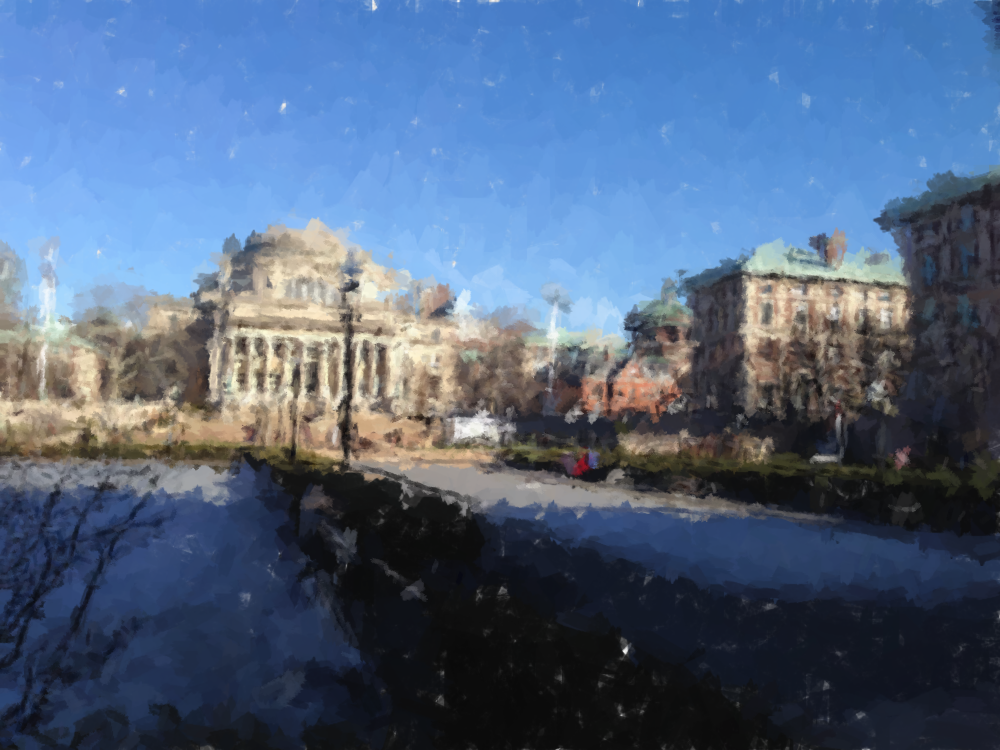

# Vango

Painterly representation of images.

## Usage

### Dependencies

This project has a few dependencies, which CMake will attempt to find:

- [**OpenCV**](http://opencv.org/): Open-Source Computer Vision Library
- [**Boost**](http://www.boost.org/): Peer-reviewed portable C++ source libraries
- [**TCLAP**](http://tclap.sourceforge.net/): Templatized C++ Command Line Parser Library
- [**yaml-cpp**](https://code.google.com/p/yaml-cpp/): YAML Parser and Emitter

You can find and install these using apt-get, [Homebrew](http://brew.sh/), or your favorite package manager. Or you can install them from source!

### Compilation

Once you've installed these, you can run CMake on each of the subdirectories `process` and `render`. Our preferred method is to make build directories in each of the directories, like so:

    > cd vango
    > mkdir process/build
    > cd process/build
    > cmake ..
    > make
    > cd -
    > mkdir render/build
    > cd render/build
    > cmake ..
    > make

The included bash script `compile.sh` also does this for you.

### Running our code!

There are two main executables in the process of creating a painted image: `./process` and `./render`. `process` will take an input PNG and output a YAML file representation of the resulting "canvas," like so:

    > cd process/build
    > ./process -i ../../assets/input_images/columbia2.png -s ../../assets/styles/columbia2.yaml -o ../../assets/canvas/columbia2.yaml

Notice that there is one extra parameter noted by `-s`: this denotes the "style" file, which includes parameters to be passed into both the process and render steps. You want to pass in this same style file when you render the canvas, like so:

    > cd -
    > cd render/build
    > ./render ../../assets/canvas/columbia2.yaml -s ../../assets/styles/columbia2.yaml -O

The `-O` flag will output a PNG filename similar to the input canvas filename; in this case, our output will be written to `./columbia2.png`. You can specify a custom output path by using the `-o` flag instead. Run `./render --help` for more information.

The included bash script `./run.sh` will run both the executables, given that input images and styles are both provided in the `assets/input_images` and `assets/styles` directories, with the same filename. So given the above file configuration, in order to paint `columbia2.png` one would type:

    > ./run.sh columbia2

`./run.sh` assumes that input images are in PNG format.

## Setup

This project is split into two main tasks:

1. Image Processing / Brush stroke creation.
    - Load up an image, and run OpenCV operations on it.
    - Output a YAML canvas file.
2. Image Rendering
    - Parse the YAML brushstroke file.
    - Output a rendered image.

More information about each of these processes are included in their own README's: The Process README is located at `process/README.md` and the Render README is located at `render/README.md`.

## File Format

The YAML format that represents the brush layers and colors is used to transmit data between the two tasks. It contains information on the following:

- Canvas
    + size {width, height}
    + style
    + palette
    + layers
        * avg width
        * texture(s)
        * avg length
        * avg opacity
        * brush strokes
            - anchor
            - length
            - width
            - opacity
            - color
            - texture (actual)

