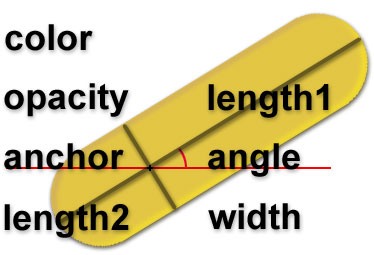
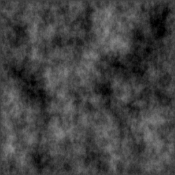
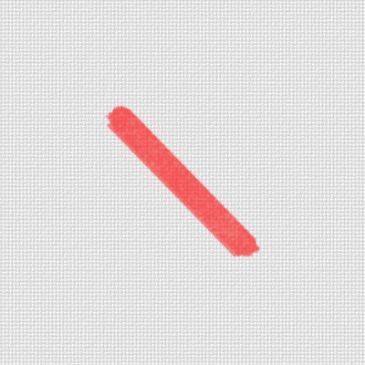

# Vango Renderer

The Vango Renderer is responsible for converting input "canvas" YAML files into painterly representations.

## Algorithm

In order to paint "brushstrokes," we have a few input parameters, defined for each brushstroke:

- Anchor Position
- Length 1
- Length 2
- Width
- Angle
- Color (R,G,B)
- Opacity

 (Taken from http://www.cc.gatech.edu/cpl/projects/artstyling/pages/brush_stroke.htm)

In addition to these, we have two textures that we use to render the brushstroke: the alpha mask, and the brush texture:

In order to render a brushstroke such as this,

we first clone-stamp the alpha mask along the path of the brushstroke, onto an empty alpha channel. This gives the general "contours" of the stroke. Then, we are free to multiply this by the brush texture to get a representation of how much "ink" is transferred onto our canvas. This resulting alpha, multiplied with the color, is alpha-blended with the canvas background to produce our final result. This step is repeated for each brushstroke.

It is worth noting that the paper [*Images and Video Based Painterly Animation*](http://cs.brown.edu/~hays/papers/IVBPA_Final.pdf) that we followed, goes about a different approach of rendering brush strokes; in Hays and Essa, brush strokes that have been captured from real paintings are cropped and rotated to match the desired dimensions, and are blended with an alpha channel and multiplied by the color. We decided to take a different approach simply because we thought that this method does not replicate the effect of paint partially applying itself onto the canvas. In many Impressionist paintings, the canvas can often be seen through the brushstrokes, and in fact the texture of the canvas plays a large role in the appearance of the brushstroke and the work itself. Therefore, we chose this method after taking inspiration from the parameters and results derived from the Brush tool in Adobe Photoshop.

